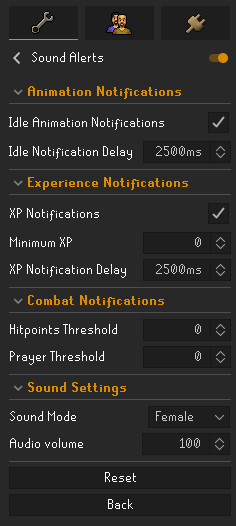

# Sound Alerts
A Runelite plugin that notifies you via text-to-speech sound that you are currently idle.

### Currently Supported Features

## Animations
- Woodcutting
- Forester Firemaking
- Cooking
- Crafting (Gem Cutting, Glassblowing, Spinning, Weaving, Battlestaves, Pottery, Smelting Jewelry)
- Fletching (Cutting, Stringing, Adding feathers and heads)
- Smithing (Anvil, Furnace, Cannonballs
- Fishing 
- Mining (Normal, Motherlode, Crashed Stars)
- Herblore
- Magic (Charging Orbs, Plank Make, String Jewelry, Tablets Making, Enchanting Jewelry, Enchanting Bolts, Bake Pie)
- Prayer
- Farming

## Experience Drops
- A notification if you haven't received an Experience Drop for that period of time.

## Combat
- A notification for when your Hitpoints & Prayer drop under a certain threshhold.

## Setting Custom Sounds
1. Navigate to your .runelite Directory in c:/users/*YOUR USER*/.runelite/
2. Make a folder named "audio" and put your desired TTS files in there with the following names for whichever sound you would like to replace.
- "health_male" - Replaces the "health" notification TTS
- "prayer_male" - Replaces the "prayer" notification TTS
- "idle_male" - Replaces the "idle" notification TTS
3. **Note**: Only .wav files are supported.

